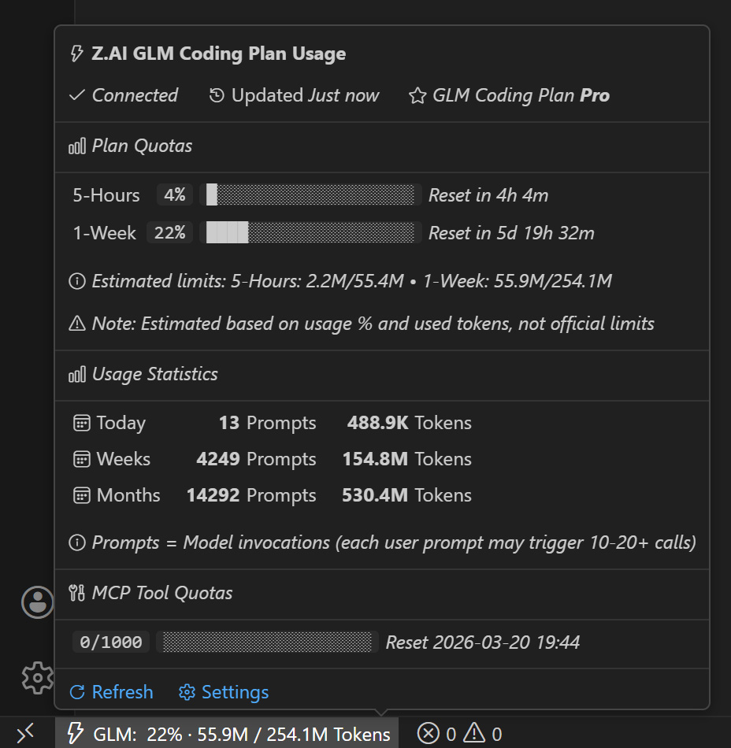

# Z.ai GLM Usage Tracker

[](https://marketplace.visualstudio.com/items?itemName=melon-hub.zai-usage-tracker)
[](https://open-vsx.org/extension/melon-hub/zai-usage-tracker)
[](https://opensource.org/licenses/MIT)

A VS Code extension that tracks your Z.ai GLM Coding Plan usage and displays it in the status bar. Also works with Windsurf, VSCodium, and other VS Code forks.

## Screenshots



## Features

- **Dynamic Quota Windows**: Automatically fetches all token quota windows from API
  - 5-hour rolling window
  - 1-week quota
  - 1-month quota
  - Displays the most relevant quota in status bar (prioritizes longest time window)

- **Rich Tooltip Display**: Hover to see comprehensive usage stats with Markdown formatting:
  - All token quota windows with progress bars and reset times
  - MCP tool usage quotas (network search, web reader, zread)
  - Today / 7-day / 30-day usage statistics
  - Account plan level (auto-detected from API)
  - Estimated token limits based on usage percentage

- **Smart Status Bar**: Modern display with VS Code Codicon icons
  - Example: `⚡ GLM: 21% · 45.8M / 220M Tokens`
  - Warning background when usage ≥ 80%

- **Auto-detected Plan Tier**: No manual configuration needed
  - API automatically returns your account level (free/pro/enterprise)
  - Displays plan tier in tooltip

- **Precise Reset Times**: Shows exact time until quota resets
  - Short periods: "in 2h 30m"
  - Long periods: full date/time "2026-02-28 14:30"

- **Debug Mode**: View raw API responses for troubleshooting
  - Command: `Z.ai Usage Tracker: Debug: Show Raw API Responses`

- **Automatic Refresh**: Configurable refresh interval (default: 5 minutes)

- **Secure API Key Storage**: Uses VS Code's encrypted SecretStorage

## Installation

### VS Code
Search for "Z.ai GLM Usage Tracker" in the Extensions marketplace, or:
```
ext install melon-hub.zai-usage-tracker
```

### Windsurf / VSCodium / Other Forks
Available on [Open VSX](https://open-vsx.org/extension/melon-hub/zai-usage-tracker). Search for "Z.ai GLM Usage Tracker" in Extensions.

### Cursor
Cursor uses a curated marketplace. Install manually:
1. Download the latest `.vsix` from [GitHub Releases](https://github.com/melon-hub/zai-usage-tracker/releases)
2. In Cursor: Extensions → `...` menu → Install from VSIX
3. Select the downloaded file

### Building from Source

```bash
npm install
npm run compile
npx @vscode/vsce package
```

## Configuration

### API Key

You need a Z.ai API key to use this extension:

1. Go to [Z.ai API Key Management](https://z.ai/manage-apikey/apikey-list)
2. Create or copy your API key
3. Click the status bar item or run command `Z.ai Usage Tracker: Configure Settings`
4. Select "Update API Key" and paste your key
5. Your key is stored securely in VS Code's encrypted storage

### Refresh Interval

Set how often to fetch usage data (in minutes):

```json
{
  "zaiUsage.refreshInterval": 5
}
```

Minimum: 1 minute, Default: 5 minutes

### Automatic Plan Detection

Your GLM Coding Plan tier is automatically detected from the API - no manual configuration needed. The extension displays your account level (Lite/Pro/Max) in the tooltip.

## Usage

Once configured, the extension will:

1. Automatically activate when VS Code/Cursor starts
2. Display usage in the status bar: `⚡ GLM: 21% · 45.8M / 220M Tokens`
3. Update periodically based on your refresh interval
4. Show detailed tooltip with Markdown formatting on hover
5. Provide quick actions on click (refresh, configure settings)

## Commands

- `zaiUsage.refresh`: Manually refresh usage data
- `zaiUsage.configure`: Open configuration menu (API key and refresh interval)
- `zaiUsage.debug`: Debug - Show raw API responses in output channel

## Status Bar Display

The status bar shows:
- **Icon**: Lightning bolt ⚡ (Codicon)
- **Label**: "GLM:"
- **Connection Status**: Empty (connected) or warning icon (error)
- **Percentage**: Usage percentage of the longest time window quota (e.g., 21%)
- **Tokens**: Actual tokens used / estimated limit (e.g., 45.8M / 220M Tokens)

Example: `⚡ GLM: 21% · 45.8M / 220M Tokens`

Background color indicates usage level:
- Normal background: < 80% quota used
- Warning background: ≥ 80% quota used

The extension automatically selects the longest time window quota (Month > Week > Hour) for display in the status bar.

## Development

```bash
npm run compile      # Compile TypeScript
npm run watch        # Watch mode
npx vsce package     # Package VSIX
```

See [CLAUDE.md](./CLAUDE.md) for full development and publishing workflow.

## How It Works

1. **API Service**: Fetches usage data from Z.ai's official monitor API endpoints
2. **Dynamic Quotas**: Retrieves all token quota windows (5-hour, 1-week, 1-month) and MCP tool limits
3. **Auto-detection**: Plan tier is automatically detected from API response
4. **Display**: Updates status bar with current usage, progress bars, and reset times
5. **Refresh**: Periodically fetches updated data (configurable interval)

## API Endpoints

The extension uses the official Z.ai monitor API endpoints:

- `https://api.z.ai/api/monitor/usage/quota/limit` - Quota limits and usage percentages (returns multiple time windows)
- `https://api.z.ai/api/monitor/usage/model-usage` - Model usage stats (prompts + tokens)
- `https://api.z.ai/api/monitor/usage/tool-usage` - MCP tool usage stats

See [API Documentation](./docs/API-DOCUMENTATION.md) for detailed API reference.

### Debugging

Run the debug command to see raw API responses:
- Command: `Z.ai Usage Tracker: Debug: Show Raw API Responses`
- Output appears in "Z.ai API Debug" output channel

## Privacy

- Your API key is stored securely in VS Code's encrypted SecretStorage
- Usage data is only fetched from Z.ai's official API
- No personal data or code is sent to external services
- All data processing happens locally

## Troubleshooting

### "API key not configured"

- Click the status bar item and select "Update API Key"
- Or use `Ctrl+Shift+P` → "Z.ai Usage Tracker: Configure Settings"

### "Failed to fetch usage"

- Check your internet connection
- Verify your API key is valid at [z.ai/manage-apikey](https://z.ai/manage-apikey/apikey-list)
- Try clicking "Refresh Usage"
- Run the debug command: `Z.ai Usage Tracker: Debug: Show Raw API Responses`

### Quota shows 0% or no data

- This is normal for new accounts or after quota reset
- The 5-hour quota resets every 5 hours
- Wait a few minutes and refresh again

## License

MIT

## Support

For issues or questions:
- [Open an issue on GitHub](https://github.com/melon-hub/zai-usage-tracker/issues)
- Check the [Z.ai Documentation](https://docs.z.ai/devpack/overview)
- Contact Z.ai support for API-related questions

## Contributing

Have an idea or found a bug? Contributions welcome!

- **Bug reports**: [Open an issue](https://github.com/melon-hub/zai-usage-tracker/issues/new?template=bug_report.md)
- **Feature requests**: [Open an issue](https://github.com/melon-hub/zai-usage-tracker/issues/new?template=feature_request.md)
- **Pull requests**: Fork, make changes, submit a PR

See [CLAUDE.md](./CLAUDE.md) for development and publishing workflow.


